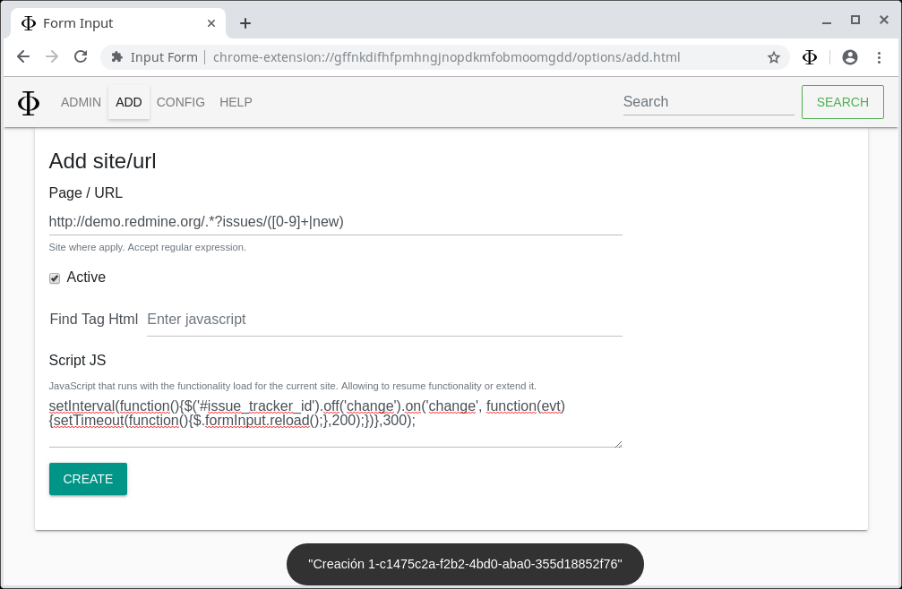
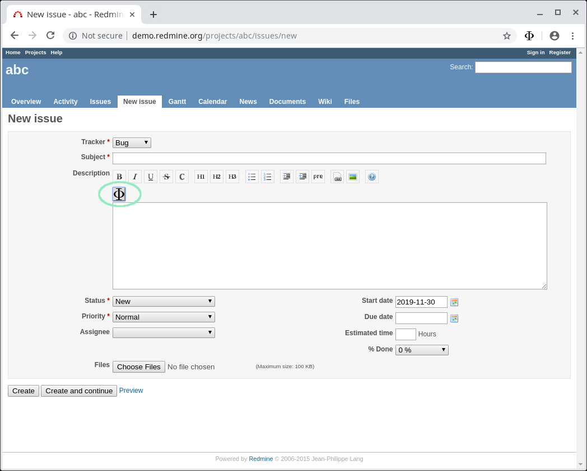
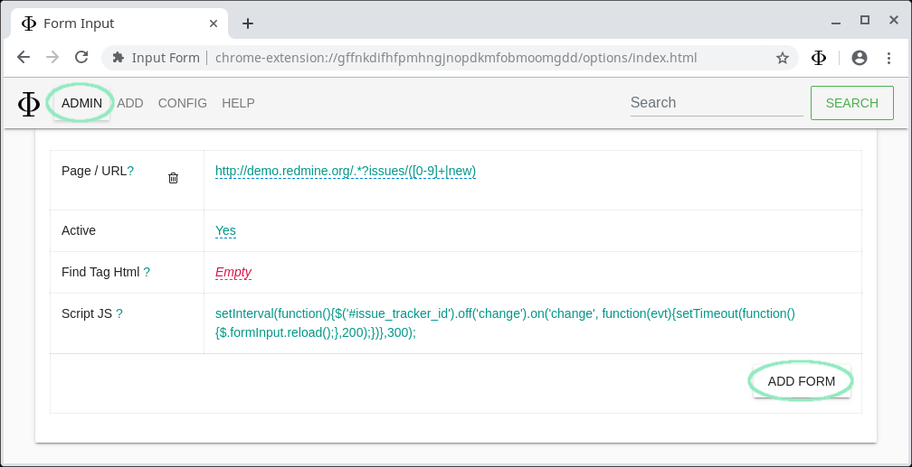
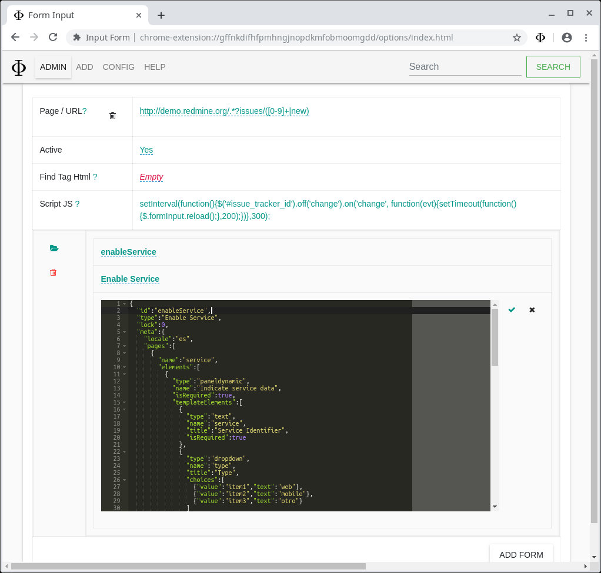
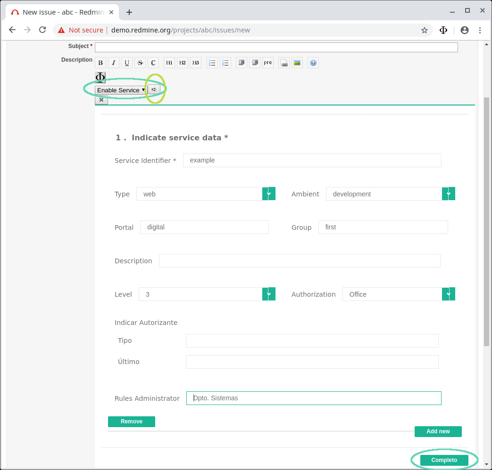
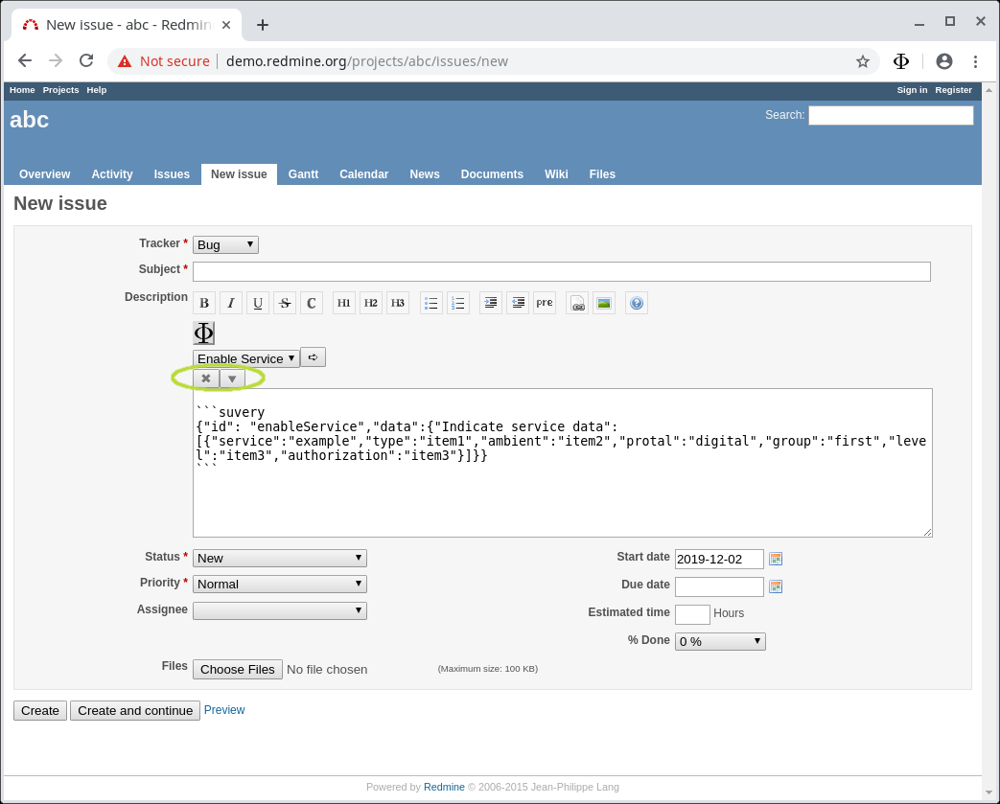
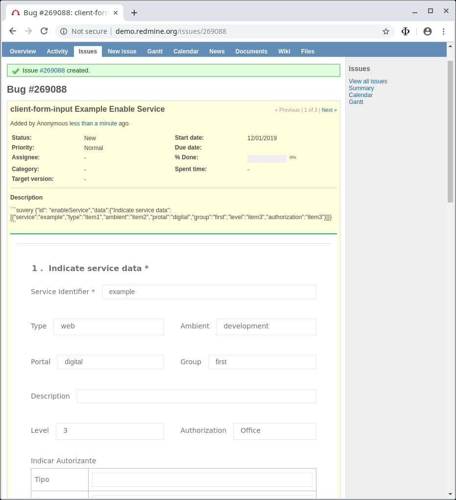
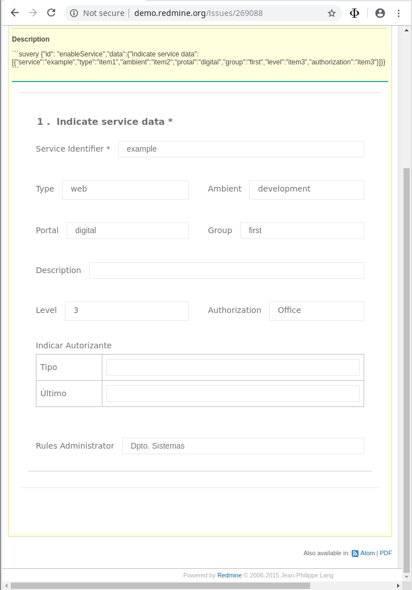

# client-form-input

En este ejemplo de utilización se pretende incluir la funcionalidad para tecket/issue de `Redmine`.

## Crear para Redmine

Crear fuente/entrada con [client-form-input](https://github.com/janusky/client-form-input) para sitio [Redmine](http://demo.redmine.org). Permitiendo contar con formularios dinámicos a la hora de ver insidentes o crearlos.

1. [Agrear URL/Site/Page](#agregar-url)

1. [Incorporar formularios](#modificar-url)

### Agregar URL

Page / URL

    http://demo.redmine.org/.*?issues/([0-9]+|new)

Script JS

```js  
setInterval(function(){$('#issue_tracker_id').off('change').on('change', function(evt){setTimeout(function(){$.formInput.reload();},200);})},300);  
```

Al finalizar la carga indicar `Agregar`



Luego de agregar/crear el sitio ([Agregar URL](#agregar-url)) puede observar el funcionamiento con la aparición de botón 



### Modificar URL

Acceder a modulo `Administrar` para agregar los formularios  



Identificador

    enableService

Tipo (texto a mostrar)

    Enable Service

Formulario (Form JSON)

> Construir el formulario con [Survey Builder](https://surveyjs.io/Survey/Builder/)/[Survey Create](https://surveyjs.io/create-survey)

```json
{
  "locale":"es",
  "pages":[
    {
      "name":"service",
      "elements":[
        {
          "type":"paneldynamic",
          "name":"Indicate service data",
          "isRequired":true,
          "templateElements":[
            {
              "type":"text",
              "name":"service",
              "title":"Service Identifier",
              "isRequired":true
            },
            {
              "type":"dropdown",
              "name":"type",
              "title":"Type",
              "choices":[
                {"value":"item1","text":"web"},
                {"value":"item2","text":"mobile"},
                {"value":"item3","text":"otro"}
              ]
            },
            {
              "type":"dropdown",
              "name":"ambient",
              "startWithNewLine":false,
              "title":"Ambient",
              "choices":[
                {"value":"item1","text":"production"},
                {"value":"item2","text":"development"}
              ]
            },
            {"type":"text","name":"protal","title":"Portal"},
            {
              "type":"text",
              "name":"group",
              "startWithNewLine":false,
              "title":"Group"
            },
            {"type":"text","name":"description","title":"Description"},
            {
              "type":"dropdown",
              "name":"level",
              "title":"Level",
              "choices":[
                {"value":"item1","text":"1"},
                {"value":"item2","text":"2"},
                {"value":"item3","text":"3"}
              ]
            },
            {
              "type":"dropdown",
              "name":"authorization",
              "startWithNewLine":false,
              "title":"Authorization",
              "choices":[
                {"value":"item1","text":"Department"},
                {"value":"item3","text":"Office"}
              ]
            },
            {
              "type":"multipletext",
              "name":"autorizante",
              "title":"Indicar Autorizante",
              "items":[
                {"name":"autorizante_tipo","title":"Tipo"},
                {"name":"autorizante_ultimo","title":"Último"}
              ]
            },
            {
              "type":"text",
              "name":"rules",
              "title":"Rules Administrator",
              "placeHolder":{"default":"System Departament ...","es":"Dpto. Sistemas"}
            }
          ],
          "panelCount":1
        }
      ],
      "questionTitleLocation":"left",
      "questionsOrder":"initial"
    }
  ],
  "showCompletedPage":false
}
```

Otros ejemplos de formularios

programming_languages

```json
{
	"questions": [
		{
			"addRowText": "Add language",
			"columns": [
				{
					"cellType": "dropdown",
					"choices": [
						"Javascript",
						"Java",
						"Python",
						"CSS",
						"PHP",
						"Ruby",
						"C++",
						"C",
						"Shell",
						"C#",
						"Objective-C",
						"R",
						"VimL",
						"Go",
						"Perl",
						"CoffeeScript",
						"TeX",
						"Swift",
						"Scala",
						"Emacs List",
						"Haskell",
						"Lua",
						"Clojure",
						"Matlab",
						"Arduino",
						"Makefile",
						"Groovy",
						"Puppet",
						"Rust",
						"PowerShell"
					],
					"choicesOrder": "asc",
					"hasOther": true,
					"isRequired": true,
					"name": "Language"
				},
				{
					"cellType": "dropdown",
					"choices": [
						"One year or less",
						"From one two three years",
						"From three to five years",
						"More then five years"
					],
					"isRequired": true,
					"name": "Experience"
				}
			],
			"isRequired": true,
			"name": "languages",
			"rowCount": 1,
			"title": "What programming languages do you know?",
			"type": "matrixdynamic"
		}
	]
}
```

Con solo ingresar los datos y presionar `enter` se van guardando



### Utilizar formularios

Luego de agregar/crear el formulario presionar el botón  y aparecerá el formulario



Imagen luego de indicar completado de datos



Cuando se guarda el ticket/issue. También puede verse como read-only.



Ver el ticket/issue




## Conclusión

Puede verse el potencial que permite normalizar/estandarizar información que pretende precizar lo que se necesita.